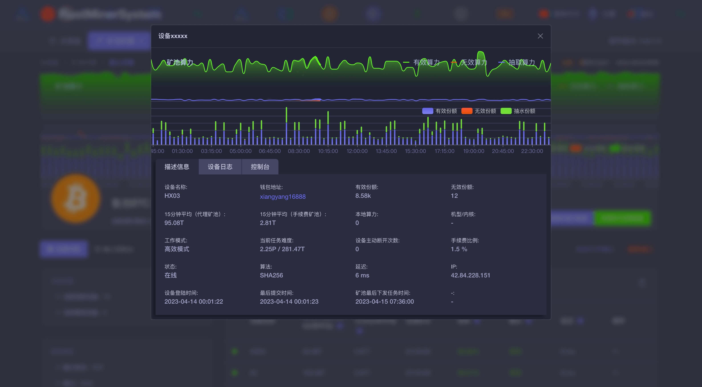

<div id="top"></div>

<div align="center">

# RustMinerSystem

<h2>A mine pool level operation and maintenance tools👍 </h2>


[![RustMinerSystem][rustminersystem.io-badge]][rustminersystem.io]
[![Downloads][downloads-badge]][releases]
[![Stargazers][stars-shield]][stars-url]

<a href="">English</a>｜<a href="">简体中文</a>

The powerful and experienced monitoring and recording system can solve the abnormal situation of the farm immediately.

The hash rate statistics at the level of mining pool, and the hash rate of any currency can be seen at a glance

Automatically adjust the working mode and data flow according to the terminal equipment to avoid highly ineffective task sharing

The active defense and filtering system improves the security of the environment and finds hazards in time.

The front-end client has high-performance TCP integration and compression technology. No matter how far the farm is from the mining pool, they can effectively reduce farm delay and prevent all middlemen from attacking.

The commission system compatible with various algorithms can reasonably improve the mine profits.

Built-in algorithm engines can update popular currencies without heating.
Perfect control logic, even if the service charge is turned on, the mine pool end will not show that the equipment is offline.

Based on the development of Rust, efficient language brings unparalleled performance.
High-performance, next-generation operation and maintenance experience, which is a professional farm operation and maintenance system-RustMinerSystem brought by the top R&D team and RUST experts in Silicon Valley

(Partial Preview)



</div>

# Join the discussion group

Telegram：<a href="sadfsadfasf">sadfsadfasf</a>

Discord：<a href="sadfasfdasfsa">sadfasfdasfsa</a>

# Special thanks


<p>Thanks for the technical support provided by the mine pool😊</p>

# Supported algorithms

For the supported algorithm, the corresponding currency will be updated without heat at any time, and the client 0 will bear the burden


| arithmetic      | Support     | Relevant currency |
| --------------- | ------------| ------------------|
| SHA256          | ✅          | BTC、BCH、BSV...   |
| ETHASH          | ✅          | ETC、ETHW、ETHF... |
| SCRYPT          | ✅          | LITE、DIGI、GOLD...|


# Service Agreement

RustMinerSystem is subject to the supervision of Hong Kong laws. Please note that the legal requirements of various countries/regions may restrict such products and services. Therefore, this product and service as well as some functions may not be available or may be restricted in some jurisdictions or regions or some users. You should understand and comply with the local laws and regulations. If you use this product, the default representative accepts the above license. If the legal problems caused by this product are irrelevant to this product.


[rustminersystem.io]: https://github.com/EvilGenius-dot/RustMinerSystem
[rustminersystem.io-badge]: https://img.shields.io/badge/RustMinerSystem-v0.0.1-green?logo=rust
[downloads-badge]: https://img.shields.io/github/downloads/ajeetdsouza/zoxide/total?logo=github&logoColor=white&style=flat-square
[releases]: https://github.com/EvilGenius-dot/RustMinerSystem/releases
[stars-url]: https://github.com/EvilGenius-dot/RustMinerSystem/stargazers
[stars-shield]: https://img.shields.io/github/stars/EvilGenius-dot/RustMinerSystem.svg?style=flat
[stars-url]: https://github.com/EvilGenius-dot/RustMinerSystem/stargazers

# Installation 

1. **Install**

   Select your applicable operating system

   <details open>
   <summary>Linux</summary>

   > Run the following shell instructions to run the toolkit
   >
   > ```sh
   > curl -sS https://raw.githubusercontent.com/ajeetdsouza/zoxide/main/install.sh | bash
   > ```
   >
   > After running successfully, you will see the following menu.
   >

   </details>

   <details open>
   <summary>Windows</summary>

   > The recommended way to install zoxide is via `winget`:
   >
   > ```sh
   > winget install zoxide
   > ```
   >
   > Or, you can use an alternative package manager:
   >
   > | Repository      | Instructions                          |
   > | --------------- | ------------------------------------- |
   > | **[crates.io]** | `cargo install zoxide --locked`       |
   > | [Chocolatey]    | `choco install zoxide`                |
   > | [conda-forge]   | `conda install -c conda-forge zoxide` |
   > | [Scoop]         | `scoop install zoxide`                |

   </details>


# Version Log
```
0.0.1
Release of internal test version
```

# Other issues

This is a free software, which does not charge any fees. It only takes 0.4% of the computing power of the terminal equipment from the technical point of view as a technical return. Billing capacity may fluctuate up and down due to the logic of the mining pool in different currencies. Generally, the floating range will not exceed+-% 0.3


