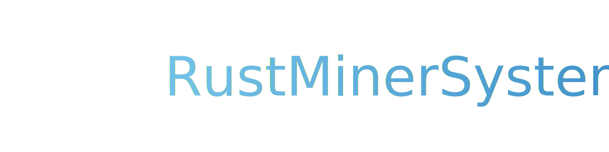
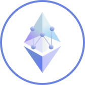

<div align="center">



<p><strong>面向矿机、矿场与矿池节点的全链路管理方案</strong></p>

<p>
  <a href="https://github.com/EvilGenius-dot/RustMinerSystem/releases">
    
  </a>
  <a href="LICENSE">
    
  </a>
  <a href="https://github.com/EvilGenius-dot/RustMinerSystem">
    
  </a>
  <a href="https://t.me/rustkt">
    
  </a>
  <a href="https://discord.gg/xpjRnv8wpX">
    
  </a>
</p>

<p>
  <a href="http://minerproxy.org/">官网</a>
  ·
  <a href="https://rustminersystem.gitbook.io/rustminersystem">详细教程</a>
  ·
  <a href="https://github.com/EvilGenius-dot/RMS">RMS 本地客户端</a>
  ·
  <a href="https://github.com/EvilGenius-dot/RustMinerSystem/releases">更新日志</a>
  ·
  <a href="https://rustminersystem.gitbook.io/rustminersystem/guan-yu/lian-xi-wo-men">联系与定制</a>
</p>

<p>
  简体中文
  ·
  <a href="Readme/i18n/zh-EN/README.md">English</a>
  ·
  <a href="Readme/i18n/zh-RU/README.md">Русский язык</a>
</p>


</div>

## RustMinerSystem 是什么

RustMinerSystem 可以用于代理传统矿池，也可以让您的设备成为真正的矿池节点。它面向矿机、矿场、矿池节点和多线路运维场景，帮助用户完成接入、转发、管理、费率配置和状态观察。

配套的本地安全客户端 [RMS](https://github.com/EvilGenius-dot/RMS) 可用于加密与压缩传输数据，在降低带宽压力的同时增强链路安全性。开始使用前，请先阅读 [服务协议](https://rustminersystem.gitbook.io/rustminersystem/guan-yu/fu-wu-xie-yi)。

## 核心能力

| 能力 | 说明 |
| --- | --- |
| 传统矿池代理 | 将矿机接入至传统矿池，统一管理连接、端口与转发策略。 |
| 自建矿池节点 | 让设备成为矿池节点，适合节点方、矿场方和自有业务场景。 |
| 自定义费率 | 支持根据业务需求配置费率，用于提升场地或节点运营收益。 |
| 安全传输 | 可配合 RMS 本地客户端完成加密、压缩与链路保护。 |
| 多平台部署 | 提供 Linux、Windows、ARM、ARMV7 等平台安装包或脚本。 |
| 可视化后台 | 浏览器访问管理后台，完成运行状态、端口、矿工等信息查看。 |

## 快速开始

> [!IMPORTANT]
> 默认后台账号为 `qzpm19kkx`，默认密码为 `xloqslz913`。首次登录后请尽快修改账号密码与 Web 访问端口。

### Linux

推荐使用 Ubuntu。复制并运行以下命令即可打开安装工具菜单：

```sh
bash <(curl -s -L https://github.com/EvilGenius-dot/RustMinerSystem/raw/main/install.sh)
```

如果所在地区访问 GitHub 较慢，可尝试备用安装地址：

```sh
bash <(curl -s -L -k https://rustminersystem.com/EvilGenius-dot/RustMinerSystem/raw/main/install.sh)
```

ARM 架构：

```sh
bash <(curl -s -L https://github.com/EvilGenius-dot/RustMinerSystem/raw/main/arm-install.sh)
```

ARMV7 架构：

```sh
bash <(curl -s -L https://github.com/EvilGenius-dot/RustMinerSystem/raw/main/armv7-install.sh)
```

安装工具运行后会出现菜单，根据提示选择安装、更新、启动、停止、修改端口、设置开机启动等操作。

<p align="center">
  
</p>

### Windows

1. 打开 [windows 目录](https://github.com/EvilGenius-dot/RustMinerSystem/tree/main/windows)。
2. 选择最新版本的 `rustminersystem-*.exe`。
3. 进入文件页面后点击 `View raw` 下载。
4. 双击运行程序，根据终端提示使用浏览器进入管理后台。

## 文档导航

| 场景 | 入口 |
| --- | --- |
| 接入传统矿池 | [传统矿池代理教程](https://rustminersystem.gitbook.io/rustminersystem/chuan-tong-kuang-chi-dai-li/dai-li-chuan-tong-kuang-chi) |
| 搭建矿池节点 | [自建矿池节点教程](https://rustminersystem.gitbook.io/rustminersystem/zi-jian-kuang-chi-jie-dian/cheng-wei-kuang-chi-jie-dian) |
| 使用 RMS 客户端 | [RMS 本地安全客户端](https://github.com/EvilGenius-dot/RMS) |
| 查看完整文档 | [RustMinerSystem GitBook](https://rustminersystem.gitbook.io/rustminersystem) |
| 联系与定制 | [联系我们](https://rustminersystem.gitbook.io/rustminersystem/guan-yu/lian-xi-wo-men) |
| 服务协议 | [服务协议](https://rustminersystem.gitbook.io/rustminersystem/guan-yu/fu-wu-xie-yi) |

## 支持算法与币种

支持的算法与币种会随版本和配置热更新。以下为当前文档中的常见支持范围：

<p align="center">
  
  
  
  
  
  
  
  
  
  
  
</p>

<details>
<summary>展开查看算法列表</summary>

| 算法 | 支持币种 |
| --- | --- |
| SHA256 | BTC、BCH、SPACE |
| ETHASH | ETC、ETHW、ETHF、OCTA、ETC+ZIL、ETHW+ZIL、ETHF+ZIL、CLORE、NEURAI、NEOXA、ZIL、CLO、UBQ、EGAZ、ELH、AVS、CAU、PAC、PWR、BTN、DUBX、XPB、REDEV2、RTH、DOGETHER |
| SCRYPT | LTC、BEL |
| KHEAVYHASH | KASPA、PYI、SDR |
| KARLSENHASH | KLS |
| BLAKE2S | KDA |
| BLAKE2B | SC、HNS |
| OCTOPUS | CFX |
| DYNEXSOLVE | DNX |
| EAGLESONG | CKB |
| EQUIHASH | ZEN、ZEC |
| LBRY | LBC |
| X11 | DASH、BLOCX |
| PROGPOW | SERO |
| BLAKE3 | ALPH、IRON |
| RANDOMX | XMR、ZEPH、NEVO |
| KAWPOW | RVN、MEWC、AIPG |
| SHA512256D | RXD |
| AUTOYKOS2 | ERG |
| NEXAPOW | NEXA |
| GHOSTRIDER | RTM、RTC、MECU、MAXE、NIKI、SUBI、NEVO |
| CUCKATOO32 | GRIN |

</details>

## 社区与支持

欢迎通过以下渠道获取更新、交流使用问题或咨询定制版本：

<p>
  <a href="https://t.me/rustkt">
    
  </a>
  <a href="https://discord.gg/xpjRnv8wpX">
    
  </a>
  <a href="https://github.com/EvilGenius-dot/RustMinerSystem/releases">
    
  </a>
</p>

## 特别感谢

感谢以下矿池在一定范围内提供技术支持：

<table>
  <tr>
    <td align="center" width="160">
      
    </td>
    <td align="center" width="160">
      
    </td>
    <td align="center" width="160">
      
    </td>
    <td align="center" width="160">
      
    </td>
  </tr>
</table>

## 服务协议

> [!CAUTION]
> RustMinerSystem 受香港法律监管。不同国家或地区的法律要求可能会限制此类产品与服务。使用前请确认您所在地区允许相关数字货币、矿机管理和矿池服务活动。

<details>
<summary>展开查看服务协议内容</summary>

RustMinerSystem 受香港法律监管。请注意，不同国家或地区的法律要求可能会限制此类产品和服务。

因此，该产品和服务以及某些功能可能不可用，或者在某些司法管辖区、地区或某些用户中受到限制。

本产品并非 VPN 类型产品，因为它无法使不允许地区访问禁止访问的内容。

本产品为矿机、矿场管理软件，并非通过不正当手段获取矿机数据。所有接入的设备均需设备拥有者主动设置矿机连接地址，以此确保任意使用本程序的客户拥有知情权。

您不在任何恐怖活动组织及恐怖活动人员名单中，如联合国安理会决议中所列的恐怖活动组织及恐怖活动人员名单。

您未被任何国家或地区的行政执法机构限制或禁止使用本程序。

您非古巴、伊朗、朝鲜、叙利亚以及其他受到相关国家政府或国际机构执行制裁的国家或地区居民。

您非限制或禁止开展数字货币相关活动国家或地区的居民，包括但不限于中国大陆地区等。

您使用本程序提供的服务在您所在的国家或地区符合相关法律法规和政策。

您同意：如因您所在国家或地区的法律法规和政策或其他任何适用法律的原因，导致您使用本程序的服务违法，您将独立承担相关法律风险和责任，您无条件且不可撤销地放弃向本程序进行追索的权利。

您应该理解并遵守当地的法律法规。如果您使用此产品，默认代表您接受上述许可与限制。若因使用本产品引起法律问题，相关责任由使用者自行承担。

</details>

## License

本项目基于 [MIT License](LICENSE) 发布。
